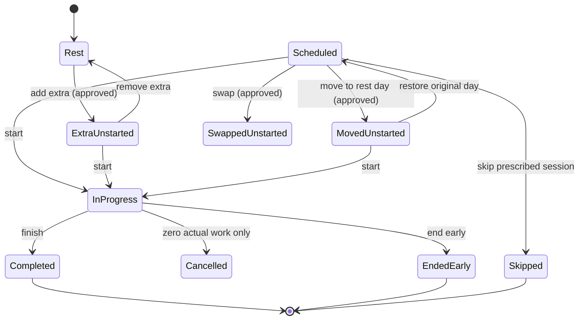
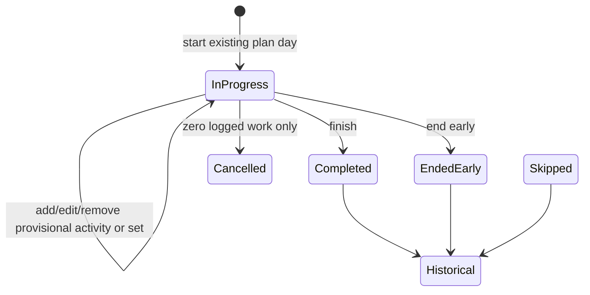
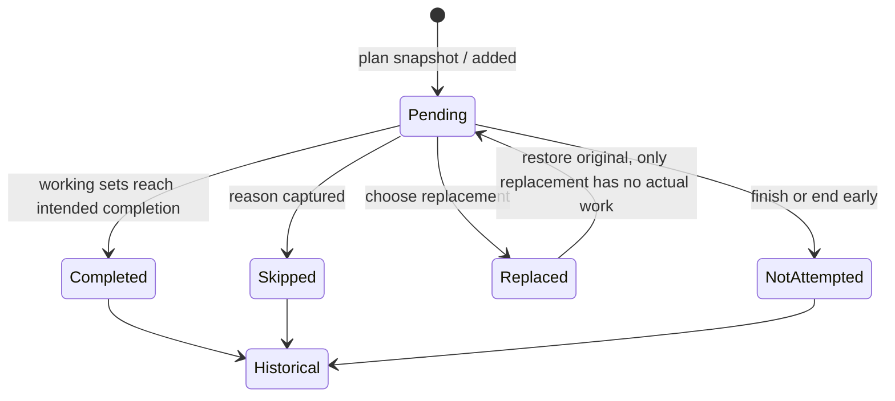
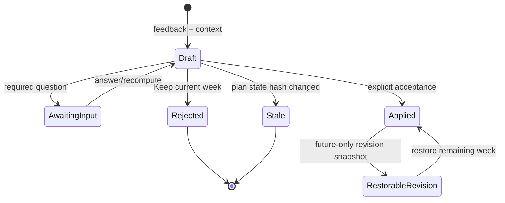

# Product state map — Phase 2.6 investigation

Audit scope: current working tree on 2026-08-17. This is intentionally an implementation reference, not an API contract. Phase 2.5 is complete in the current worktree; this map audits the Phase 2.6 state/recovery boundary on top of those capabilities.

## Product invariants

1. A plan is prescribed intent; a session is performed fact. Neither is a mutable substitute for the other.
2. Future plan changes are reversible until a session on the affected day has recorded actual activity.
3. A completed, ended-early, or skipped outcome is immutable history. A started session with **zero recorded actual work** may be cancelled back to its prior future-plan state; otherwise it is historical.
4. Extras never increase prescribed-intent adherence. They are separately reported actual activity.
5. State transitions, ownership, validation, calculations, and undo/removal are deterministic domain operations; GPT-5 proposes only contextual training changes.

## Entity state machines

### Planned day

`origin` currently stores only `extra | moved | null`; it is a display marker, not enough provenance to restore an original day.

| State | Primary action | Secondary action | Escape / policy | Adherence / history |
|---|---|---|---|---|
| Rest | Train today | Move workout here | Close | no denominator |
| Scheduled, unstarted | Start | Move; Skip | Restore only if it was moved | denominator +1; no history yet |
| Extra, unstarted | Start | Move | **Remove extra → Rest** | excluded from denominator; no history yet |
| Moved, unstarted | Start | Move again | **Restore original day** | original prescribed denominator follows workout; no history yet |
| In progress | Resume | End early | Cancel only if no actual work | plan freezes once actual work exists |
| Completed | View | — | immutable (future correction is a separately auditable correction flow) | numerator for prescribed day if it was prescribed |
| Ended early | View outcome | — | immutable | not completed; actual work retained |
| Skipped | View outcome | — | immutable outcome; do not turn into remove | prescribed denominator; not numerator |

### Session and actual work

Current code has no status guard on several mutation routes. The required transition rule is: only `in_progress` can receive sets, activity edits, added exercises, replacements, skips, or exercise completion. The one exception is explicit cancellation of an empty start.

### Session exercise

| State | Required UI action | History rule |
|---|---|---|
| planned pending | log set; replace; skip; do later | mutable while session in progress |
| added pending | log; remove added exercise | remove only before it has a set |
| replacement pending | log; **Restore original** | restore only before replacement has a set |
| completed / skipped / not attempted | view reason and work | immutable after session outcome |
| warm-up set | edit/delete while session is in progress | never a progression or e1RM working set |
| working set | edit/delete while session is in progress | only valid performance signal for its measurement type |

### Week rebuild proposal and revision

The current proposal model correctly has a rebuild `state_hash` and idempotent apply, but an applied rebuild deletes/recreates plan exercises and clears `origin`. It has no applied revision baseline or restore path.

## Reversibility vocabulary

| Term | Exact meaning | Allowed when |
|---|---|---|
| Remove extra | Erase an optional, unstarted future addition and return the day to Rest | extra has no session / actual work |
| Restore original day | Undo an unstarted move and put its unchanged prescription back | both affected days have no session / actual work |
| Restore original exercise | Remove an unperformed replacement and reactivate the planned entry | replacement has no set / actual work |
| Skip | Record that prescribed intended work was not performed, with a reason | prescribed day/exercise is unstarted or pending |
| End early | Record that a session began and stopped; retain all performed work | in-progress session |
| Cancel start | Remove only an accidental, zero-work in-progress session | no sets, activities, exercise outcome, or added work |
| Keep current week | Reject a draft proposal; no plan mutation | proposal is not applied |
| Restore remaining week | Revert a specific applied revision only on still-unstarted, future days | revision snapshot exists; no intervening incompatible mutation |
| Delete | Avoid for training history. Use only for a provisional activity/set before session finalisation, or an auditable correction workflow later | explicitly defined narrow cases |

## Measurement semantics

| Type | Required actual fields | Optional fields | Progress evidence | Never calculate |
|---|---|---|---|---|
| `weighted_reps` | external load, reps | RPE; set role | load + reps + RPE, working sets only | e1RM from warm-ups |
| `bodyweight_reps` | reps | assistance/load delta only when explicitly modelled; RPE | reps/RPE trend | weighted e1RM from `0 kg` |
| `assisted_reps` (missing) | reps, assistance amount/direction | RPE | assistance-normalised trend once defined | raw weighted e1RM |
| `timed_hold` | seconds | RPE | duration/RPE trend | reps or weighted e1RM |
| `duration` | duration seconds | RPE, notes | exposure/dose only | set-count strength progression |
| `distance_duration` | duration; distance when known | pace/speed, incline, RPE | dose and cardio trend | resistance e1RM / strength-set progression |

General warm-up is an activity (`role=warmup`); exercise-specific warm-up is a resistance set (`set_type=warmup`). Working sets alone contribute to resistance progression and prescribed set completion.

## Current-week card action matrix

| Visible state | Current primary | Current secondary | Missing / required escape |
|---|---|---|---|
| Rest | Train today | Move a workout here | none |
| Planned unstarted | Start | Move; Skip | none |
| Extra unstarted | Start | Move; **currently Skip** | **Remove extra → Rest** |
| Moved unstarted | Start | Move | **Restore original day** |
| In progress | Resume | — | End early and Cancel empty start should be obvious |
| Completed | View workout | — | immutable |
| Ended early | View outcome | — | immutable |
| Skipped | View outcome | — | immutable; no misleading undo |
| Missed (calendar-derived) | Start | Move; Skip | explain whether it is merely late vs a recorded skip |

## Active-workout action matrix

| Item state | Current action(s) | Required safe action(s) | Escape / lock |
|---|---|---|---|
| Planned pending exercise | Complete set; replace; skip; do later | same; add a server-backed restore for a skipped pending item | mutable only while session is in progress |
| Added pending exercise | not reachable from mobile UI | log; **Remove added exercise** | remove only before logged actual work |
| Replacement pending | log; generic menu | **Restore original exercise** clearly shown | restore only while no replacement set/activity exists |
| Replaced original | can still be navigated because it is rendered as setup | non-actionable “Replaced by X”; Restore when legal | never allow original and replacement to be logged simultaneously |
| Completed exercise | summary/list | view logged work; correction only via explicit policy | no silent mutation after finalisation |
| Skipped exercise | local-only Undo Skip | server-backed Restore while in progress, otherwise View reason | lock after terminal session outcome |
| Warm-up resistance set | checkbox and standard set fields | edit/remove provisional set; visually separate from working target | excluded from progression/e1RM |
| Working resistance set | weight/reps/seconds + RPE | semantic controls by measurement; edit/remove provisional set | only working evidence eligible for strength progress |
| Generic activity | duration-only add | named activity, duration/distance/pace/incline/RPE, edit/remove list | activity becomes actual history at finalisation |

## Current implementation facts that violate this map

- `createSession` accepts a rest day and can create duplicate sessions; there is no per-day active-session guard.
- scheduling checks only `completedAt`; it can move a day with an in-progress session, changing the live plan under actual work.
- finished/ended sessions can still receive sets, activities, replacements, and exercise-status writes through current domain/API guards.
- `restoreSessionExercise` deletes replacement sets, even after actual work, and the mobile UI does not expose Restore.
- `origin` has no source-day/revision identity, so a reliable move/extras/rebuild rollback cannot be reconstructed.
